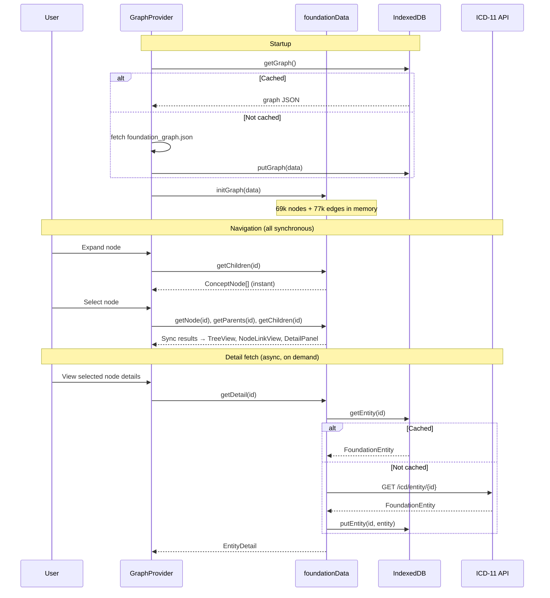

# ICD-11 Visual Maintenance Interface — Design Specification

## Overview

A visual interface to the ICD-11 maintenance platform that helps proposal authors and reviewers understand the neighborhood and potential impacts of proposed changes to the Foundation.

**Key goals:**
- Expose polyhierarchy structure (concepts with multiple parents)
- Facilitate understanding of change impacts
- Support proposal authoring workflow
- Provide hierarchical (not force-directed) visualizations

**Technology stack:** React, TypeScript, D3.js, graphology.js, elkjs, IndexedDB

**Deployment:** GitHub Pages (auto-deploy on push to main); later integration with .NET maintenance platform

---

## Implementation Status

Legend: :green_circle: Done | :red_circle: Bug | :yellow_circle: In progress / needs design | :white_circle: Not started | :black_circle: Future

| Area | Feature | Status |
|------|---------|--------|
| **Tree View** | Expand/collapse, parent/child badges | :green_circle: |
| | Multi-path highlighting | :green_circle: |
| | Descendant count + depth badges in tree | :green_circle: Font-weight badges |
| | First-occurring path expansion via URL | :red_circle: Uses arbitrary parent |
| | Collapse heuristics for large trees | :white_circle: |
| **Node-Link View** | Hierarchical layout (elkjs), click to navigate | :green_circle: |
| | Full ancestor DAG to second level | :green_circle: |
| | Collapsible clusters (threshold: 2) | :green_circle: |
| | Resizable panels | :green_circle: |
| | Foundation ordering of siblings | :yellow_circle: Partially (model order hint) |
| | [Scalability features #3–12](#potential-solutions) | :white_circle: See design section |
| **Detail Panel** | Title, definition (async), browser link | :green_circle: |
| | Collapsible parents/children lists | :green_circle: |
| | Parent/child/descendant badges | :green_circle: |
| | Paths to root | :yellow_circle: |
| **Data Layer** | Full graph preload + IndexedDB cache | :green_circle: |
| | On-demand entity detail fetch | :green_circle: |
| **Proposal Authoring** | All features | :black_circle: |

---

## Data Model

### ICD-11 Foundation Structure

The Foundation is a polyhierarchy: concepts can have multiple parents. ~69k entities, ~77k edges.

### Canonical vs Linked Parents

> **Investigation needed:** The maintenance platform distinguishes between regular and "linked" parent relationships. Some children appear grayed out in the maintenance platform, suggesting a different relationship type.
>
> **Hypothesis:** The canonical parent may be determined by where the concept appears in the MMS linearization.
>
> **Action:** Verify whether the public API exposes this distinction, or if it must be inferred by cross-referencing Foundation and MMS.

### Internal Representation

<details>
<summary>Types and data flow (click to expand)</summary>

The full Foundation graph is pre-crawled and loaded at startup. graphology.js stores the in-memory structure:

```typescript
// Structural data — available synchronously after init
interface ConceptNode {
  id: string;
  title: string;
  parentCount: number;
  childCount: number;
  childOrder: string[];      // children in Foundation order
  descendantCount: number;   // unique descendants (pre-computed)
  height: number;            // longest downward path to any leaf (leaf=0)
  depth: number;             // shortest path from root (root=0)
  maxDepth: number;          // longest path from root (root=0)
}

// Rich metadata — fetched on-demand from ICD-11 API, cached in IndexedDB
interface EntityDetail {
  definition?: string;
  longDefinition?: string;
  synonyms: string[];
  narrowerTerms: string[];
  inclusions: string[];
  exclusions: Array<{ label: string; foundationReference?: string }>;
  browserUrl?: string;
}
```

Edges are untyped directed edges (parent → child). See `foundationData.ts` for the unified data API.

#### Three-Layer Architecture

1. **`foundationStore.ts`** — IndexedDB cache. Stores/retrieves graph structure and entity details.
2. **`foundationData.ts`** — Unified data API. Owns the graphology instance. Sync reads for structure, async for entity details.
3. **`GraphProvider.tsx`** — React context. UI state (selection, expansion paths) and init. Exposes `foundationData` functions on context.

#### Data Flow



</details>

---

## Views

### 1. Indented Tabular View (Primary)

The main navigation interface. Renders the polyhierarchy as a tree where concepts with multiple parents appear multiple times. All instances reference the same underlying object — selection of one highlights all.

<details>
<summary>Current behavior and mockup (click to expand)</summary>

| Feature | Status |
|---------|--------|
| Same object, multiple appearances (selection syncs all) | :green_circle: |
| Parent count badge `[N↑]` (when > 1) | :green_circle: |
| Child count badge `[N↓]` | :green_circle: |
| Expand on demand (instant, in-memory) | :green_circle: |
| Multi-path highlighting | :green_circle: |

```
┌────────────────────────────────────────────────────┐
│ ▼ Diabetes mellitus                    [1↑] [8↓]   │
│   ▶ Type 1 diabetes mellitus           [1↑] [3↓]   │
│   ▶ Type 2 diabetes mellitus           [1↑] [5↓]   │
│   ▶ Malnutrition-related diabetes      [1↑] [0↓]   │
│   ▷ Diabetes mellitus in pregnancy     [2↑] [2↓]   │  ← muted style (linked?)
│   ▷ Neonatal diabetes mellitus         [2↑] [1↓]   │  ← muted style (linked?)
│   ▶ Acute complications of DM          [1↑] [4↓]   │
└────────────────────────────────────────────────────┘
```

</details>

#### Open design work

- **Descendant stats badges**: Data available on `ConceptNode` (descendantCount, height). Need to design badge placement in tree rows.
- **First-occurring path expansion** :red_circle:: URL navigation (`?node=ID`) uses `parent[0]` which may not be first in Foundation order.
- **Collapse heuristics**: Auto-collapse deep/large subtrees based on depth, subtree size, or user preference.
- **Show all paths to root**: Detail panel or tree-integrated breadcrumbs showing every distinct path from selected node to root.

### 2. Node-Link Diagram (Secondary)

D3-based DAG visualization of the local neighborhood around the selected node.

**Current state:** Hierarchical layout (elkjs), ancestor chain to second level, collapsible clusters for high-degree nodes (threshold: 2 visible children), click to navigate, resizable panels.

#### Scalability & Readability

The core design challenge. High-degree nodes (up to 331 children) make the view unreadable at any zoom level.

#### Potential Solutions

| # | Approach | Status | Notes |
|---|----------|--------|-------|
| 1 | **Ancestors beyond 1-hop** | :green_circle: | Chain to depth 2 (skip root + top-level) |
| 2 | **Collapsible clusters** | :green_circle: | First 2 children shown, rest grouped as "N more..." |
| 3 | **Hover behavior** | :white_circle: | [Full spec below](#hover-behavior) — tooltip, detail panel, tree highlight, transient neighbors |
| 4 | **Right-click/long-click toggle** | :white_circle: | Pin/unpin specific neighbors |
| 5 | **Close individual nodes** | :white_circle: | X button; closed nodes rejoin cluster count |
| 6 | **Area-proportional badges** | :white_circle: | Badge area ∝ count; median = default size; separate medians per type |
| 7 | **Staggered levels** | :white_circle: | Labella.js-style overlap avoidance |
| 8 | **Resizable panels** | :green_circle: | Drag dividers between three panels |
| 9 | **Pop-out window** | :white_circle: | Full-screen node-link in separate window |
| 10 | **Full ancestor DAG** | :green_circle: | BFS through all parents to depth 2; [stress test results](#stress-test-high-parent-count-nodes) |
| 11 | **Scrollable clusters** | :white_circle: | Cluster summary in SVG; hover/click shows HTML child list overlay; pop children out into real nodes |
| 12 | **Full-width bottom panel** | :green_circle: | Two switchable layouts (two-row / two-col); RIGHT direction; native scroll; zoom/pan removed |

#### Feature Compatibility


**Works well together:**
- **2+6** (Clusters + Badges): Collapsed clusters show aggregate badge values.
- **3+4** (Hover + Toggle): Hover previews → right-click pins. Natural progression.
- **4+5** (Toggle + Close): Unify as per-node visibility state via context menu + close button.
- **2+3** (Clusters + Hover): Hover over cluster to preview contents.
- **6** (Badges): Orthogonal to all others — renders independently within each node.
- **10+2** (Ancestor DAG + Clusters): Ancestors can have clustered children too.
- **11+2** (Scrollable Clusters replaces current Clusters): Evolution of cluster concept — avoids layout explosion on expand.
- **12+11** (Bottom Panel + Scrollable Clusters): RIGHT layout in wide panel, scrollable clusters for children.

**Needs care:**
- **5+2** (Close + Clusters): Closed nodes rejoin cluster counter, e.g., "2 parents (1 hidden)."
- **3+5** (Hover + Close): Hover temporarily shows closed nodes → three-valued visibility state.
- **9** (Pop-out): Cross-window sync questions. Minimal viable approach: no sync with tree, just allow exploring and selecting a new focal node in the pop-out.
  - **[sg]** maybe just leave the middle panel alone and no communication between pop-out and tree/details, just allow the user to explore the node-link view separately in a wide screen. hmm... after exploring they might want to choose a new focal node, could allow just that
- **12+8** (Bottom Panel + Resizable): Two layout modes — (a) two rows: tree+detail on top, node-link on bottom, or (b) two columns: tree on left, detail+node-link on right. Draggable borders in either mode. Users switch based on whether tree or node-link is their focus.

**Node visibility state model** (for #3, #4, #5):

| State | Meaning | How set |
|-------|---------|---------|
| **default** | Neighborhood algorithm decides | Initial state |
| **pinned** | Always shown | Right-click toggle on |
| **closed** | Hidden unless hovered | Close button or toggle off |

Hover temporarily overrides `closed` → visible. Changing focus resets all to `default`.

#### Design Notes

> **[sg]**
> - Collapsible clusters (#2): good idea. Will have to try some things and see how it works with other techniques
> - Fisheye: good technique for unreadable stuff; try if other approaches don't fully solve the problem. Radial layout: no.
> - Area-proportional badges (#6): don't size the rectangles — size individual badges. Badges on right side of concept name, area ∝ count, median count = default size, separate medians for parent/child/descendant badges
> - Hover (#3): could consider ideas from `../dynamic-model-var-docs/src/components/` (FloatingBoxManager, LayoutManager, TransitoryBox) — prior art for persistent/transitory info display in crowded spaces
> - If there are edge types or other ways of grouping neighboring nodes, show them as groups that can be explored or expanded
> - Staggered levels (#7): see https://twitter.github.io/labella.js/ — try both simple and overlap algorithms. Horizontal flow: see https://twitter.github.io/labella.js/with_text.html
> - Hybrid layout (old #10): L-shaped split (manual vertical ancestors + ELK horizontal children) won't work because ancestor polyhierarchy means ancestors aren't linear, and child expansion on ancestors creates nodes in both sections.
> - Scrollable clusters (#11): scrollable boxes don't work directly in SVG. Cluster node shows summary; hover/click expands to an HTML list overlay (could replace detail panel or float on top). Clicking a child in the list promotes it to a real graph node. Single edge from parent to cluster.
> - Scroll vs zoom: zoom/pan is powerful but awkward. At a given zoom level, if content overflows, enable native scrolling. For RIGHT layout in full-width bottom panel, horizontal scroll is natural.
> - Full ancestor DAG (#10): :green_circle: done. Stress test confirms: orthogonal routing + truncated titles + wide fanout = unreadable for 6+ parent nodes. Layout engine is now the bottleneck.

#### Stress Test: High Parent-Count Nodes

Nodes with the most parents in the Foundation. These are the worst cases for ancestor DAG layout — 9 parents at depth 4–5 produces ~22 nodes with heavily overlapping orthogonal edges, essentially unreadable at default zoom.

| Parents | Depth | Node | ID |
|---------|-------|------|----|
| 9 | 4 | [Injury or harm arising from surgical or medical care, NEC](https://sigfried.github.io/icd11-playground/?node=383104340) | 383104340 |
| 9 | 5 | [Dyskeratosis congenita](https://sigfried.github.io/icd11-playground/?node=1531033936) | 1531033936 |
| 7 | 9 | [DPT-HepB-MenAC vaccines](https://sigfried.github.io/icd11-playground/?node=10241378) | 10241378 |
| 7 | 6 | [Kearns-Sayre syndrome](https://sigfried.github.io/icd11-playground/?node=399100745) | 399100745 |
| 7 | 9 | [DPT-IPV-Hib-HepB vaccines](https://sigfried.github.io/icd11-playground/?node=1234470901) | 1234470901 |
| 7 | 5 | [Ataxia-telangiectasia](https://sigfried.github.io/icd11-playground/?node=2129036552) | 2129036552 |
| 6 | 6 | [Zellweger syndrome](https://sigfried.github.io/icd11-playground/?node=226023718) | 226023718 |
| 6 | 5 | [Bannayan-Riley-Ruvalcaba syndrome](https://sigfried.github.io/icd11-playground/?node=357383447) | 357383447 |
| 6 | 9 | [DPT-IPV-Hib vaccines](https://sigfried.github.io/icd11-playground/?node=675122679) | 675122679 |
| 6 | 6 | [Hereditary haemorrhagic telangiectasia](https://sigfried.github.io/icd11-playground/?node=714406192) | 714406192 |

**Observations:**
- Even single-hop (just direct parents) would be wide and messy for 9-parent nodes — this isn't just a DAG depth problem
- Truncated titles (all "Postprocedural disor...") make the middle layer indistinguishable — hover/tooltip needed
- Orthogonal edge routing creates a dense tangle when many edges converge on one node
- The multi-system syndromes (Dyskeratosis congenita, Kearns-Sayre, Ataxia-telangiectasia) and combination vaccines are natural stress cases

#### Hover Behavior

Hovering a node in the node-link view should do all of the following:

1. **Tooltip with full title** — shows the untruncated concept name (addresses the "Postprocedural disor..." problem) :green_circle:
2. **Detail panel preview** — show the hovered node's details (title, definition, metadata) in the detail panel without changing selection; shows "Preview" badge :green_circle:
3. **Tree highlight** — highlight/scroll-to the hovered node in the tree view (all instances if polyhierarchy)
4. **Transient neighbors** — temporarily show parents and children not already in the view, with a visual distinction (e.g., dashed border, lower opacity) so they're clearly transient. These disappear on mouse-out.

On mouse-out: revert detail panel to selected node, remove tree highlight, remove transient neighbors.

Click remains "select" — it changes the focus node permanently. Hover is purely preview/exploration.

**Interaction with other features:**
- **+Toggle (#4)**: Hover previews → right-click pins a transient neighbor permanently
- **+Clusters (#2)**: Hover over cluster shows its contents (list overlay or transient expansion)
- **+Close (#5)**: Hover temporarily reveals closed nodes

> **[sg]** Prior art for persistent/transitory display in crowded spaces: `../dynamic-model-var-docs/src/components/` (FloatingBoxManager, LayoutManager, TransitoryBox)

#### Cluster Node Behavior

Cluster pseudo-nodes ("7 more children, 194 descendants") represent hidden children. They need their own interaction model:

| Action | Behavior | Status |
|--------|----------|--------|
| **Click** | Expand cluster into real nodes in the graph | :green_circle: |
| **Hover** | Show scrollable list of hidden children (HTML overlay) | :white_circle: |
| **Hover → click child** | Promote child to real graph node (or select it) | :white_circle: |

The hover overlay is related to #11 (Scrollable Clusters) — a lightweight HTML list positioned near the cluster node, showing title + badges for each hidden child. Clicking a child in the list could either:
- **Select it** — changes focus, re-centers the view
- **Promote it** — adds it as a real node in the current view without changing focus

> **[sg]** This connects to the broader question of how to explore without losing context. Promoting a child keeps the current focus but enriches the view. Selecting navigates away. Both are useful.

#### Badge Interactions

Badges are interactive — hovering previews related nodes, clicking expands or navigates to them. This replaces the current "click the node, then look at the detail panel" flow with direct "show me the parents/children/descendants" actions.

##### Badge hover

Hovering a badge previews the nodes it refers to without committing to a navigation. The preview is transient — it disappears on mouse-out.

| Badge | Hover behavior |
|-------|---------------|
| **N↑ parents** | Highlight parent nodes wherever they appear: in NL graph (glow/outline on existing parent nodes), in tree (highlight all instances). If parents aren't visible in NL, show them as ghost nodes (low opacity, positioned but not part of the permanent layout). |
| **N↓ children** | In NL: if children are in a cluster, show a floating list overlay (like #11 scrollable clusters). If children are already visible, highlight them. In tree: no-op (children are visible when expanded, hidden when collapsed). |
| **N▽ descendants** | Show descendant count breakdown as a tooltip or mini-tree: immediate children count, grandchildren count, max depth. Gives a sense of subtree shape without expanding. |

**Cross-panel coordination:** Badge hover in any panel highlights related nodes in all panels. For example, hovering `2↑` in the tree highlights the parent nodes in NL and scrolls to them in the detail panel's parents list.

##### Badge click

Clicking a badge expands or navigates to show the related nodes. The effect depends on the panel and badge type.

| Badge | Click behavior | Notes |
|-------|---------------|-------|
| **N↑ parents** | Show all parents of this node | In tree: expand all parent paths. In NL: add parent nodes to graph. In detail: already shown in parents list. |
| **N↓ children** | Show children of this node | In tree: expand this node. In NL: add children to graph (or expand cluster). In detail: already shown in children list. |
| **N▽ descendants** | Open subtree rooted at this node | In tree: expand recursively (with depth limit?). In NL: navigate to this node as focus. In detail: navigate to this node. |

**Tree View:**
- `↑` click: Find and expand all paths through this node's parents (expensive for deeply nested polyhierarchy — may need progressive expansion)
- `↓` click: Equivalent to clicking the expand arrow — toggles expand for this tree path
- `▽` click: Navigate to this node (select it), which enables exploring its subtree

**Node-Link View:**
- `↑` click: Add all parents to the NL graph (even those filtered by ANCESTOR_MIN_DEPTH). Re-run layout.
- `↓` click: Expand the cluster if children are clustered; otherwise add children to graph. Re-run layout.
- `▽` click: Re-focus the NL view on this node (equivalent to clicking it — select it as the new focus)

**Detail Panel:**
- `↑` click on a list item: Navigate to that item and show its parents
- `↓` click on a list item: Navigate to that item and expand its children
- `▽` click on a list item: Navigate to that item

##### Visual feedback

- **Hover cursor:** pointer on badge hover (already supported via `onClick` prop)
- **Hover highlight:** badge background lightens or glows to indicate interactivity
- **Active state:** brief press feedback on click
- **Ghost nodes** (NL hover preview): 30% opacity, dashed border, no click interaction. Removed on mouse-out.

##### Open questions

1. **NL graph growth** — Adding parents/children to the NL graph can make it very large. Should there be a "reset to default neighborhood" button? Should added nodes have a visual distinction (e.g., dashed border) like the transient neighbors concept in hover (#3)?
2. **Tree expand-all-parents** — For a node with 9 parents, expanding all parent paths could be overwhelming. Progressive expansion (expand one level up, click again for more) might be better.
3. **Undo** — Should badge-expand be undoable? Or just rely on re-selecting the focus node to reset?
4. **Interaction with existing expand/collapse** — Tree `↓` badge click = expand toggle. But what if the node is already expanded? Toggle closed? Or no-op?
5. **Hover latency** — Ghost nodes in NL require layout computation. Should badge hover trigger layout immediately, or only after a short delay (150ms)?
6. **Descendant hover depth** — How deep should the descendant tooltip go? Just immediate stats, or a mini-tree of the first 2–3 levels?

##### Implementation considerations

- Badge component needs `onClick` and `onMouseEnter`/`onMouseLeave` wiring
- NL view needs ability to add/remove nodes from the neighborhood without changing focus — significant change from the current "rebuild neighborhood from scratch on selection change" model
- Ghost node rendering: add nodes to layout with a `ghost` flag, render with distinct style, remove on mouse-out without re-running full layout
- Tree `↑` expand requires walking up all parent chains and expanding each path prefix — similar to `navigateToNode` but for all parents, not just the first
- Cross-panel coordination needs a shared "highlighted nodes" state in GraphProvider
- May want to debounce or animate layout changes when adding nodes to NL graph

#### Implementation Priority

**Phase 1 — High impact, low/medium effort:** :green_circle: Done
- #8 Resizable panels, #2 Collapsible clusters, #1 Ancestors beyond 1-hop

**Phase 2 — Stress test + medium effort features:**
- #10 Full ancestor DAG — :green_circle: done; [stress test results](#stress-test-high-parent-count-nodes) confirm layout is the bottleneck
- #6 Area-proportional badges — :green_circle: done: shared Badge component with per-type count→font-weight bins, consistent colors (parents=cyan, children=green, descendants=orange) across all three panels, aligned columns in tree view, foreignObject in NL SVG
- #3 Hover preview — :yellow_circle: partial: in-place node expansion with text wrapping, detail panel preview; tree highlight and transient neighbors still open
- #12 Full-width bottom panel — :green_circle: done: two switchable layouts, RIGHT direction, viewBox zoom, scroll-to-focus, zoom controls

**Phase 3 — Next up:**
- #11 Scrollable clusters — HTML overlay on cluster hover, replace current click-to-expand
- #3 Tree highlight — highlight hovered node in tree view
- #4+5 Toggle/Close (unified as visibility state)
- #7 Staggered levels — evaluate after clusters; may require replacing elkjs

**Layout engine:**
- Evaluate elkjs vs igraph vs manual layout — edge crossing minimization is poor for complex DAGs
- igraph supports forced vertical layering (nodes assigned to specific layers)

**Rendering refinements (backlog):**
- NL hover positioning refactor — hover expansion is rightward-biased (scales from top-left); SVG overflow:visible + margins is a workaround not a proper fix; consider anchoring expansion from center, or using a portal/overlay outside SVG for hover content
- Selected node vertical positioning — place focus node near top or aligned with tree selection

**Defer:**
- Fisheye — only if the above doesn't suffice

### 3. Detail Panel

Shows concept metadata, parents list, children list. Title appears instantly from graph; definition loads asynchronously from API (cached in IndexedDB).

<details>
<summary>Current state and known issues (click to expand)</summary>

**Implemented:**
- Concept title, definition (async), long definition
- Link to Foundation browser
- Collapsible parents list with badges (click to navigate)
- Collapsible children list with badges (click to navigate)
- Descendant count in metadata
- Parent/child/descendant badges on all relation list items

**Known issues:**
- Parents/children lists largely duplicate the tree. Should show information not visible in tree.

</details>

#### Open design work

- **Paths to root**: Show all distinct paths from selected node to root as clickable breadcrumb trails. Directly addresses the polyhierarchy navigation problem.
  ```
  Paths to Root:
    1. ... > Bacterial intestinal infections > Abdominal actinomycosis
    2. ... > Other bacterial diseases > Actinomycosis > Abdominal actinomycosis
  ```

---

## Proposal Authoring

> **Note:** Interface design TBD. Include this capability in the architecture.

<details>
<summary>Requirements and design questions (click to expand)</summary>

### Requirements

1. **View existing proposals** affecting a concept or its neighborhood
2. **Author new proposals** for adding, modifying, moving, or deprecating concepts (including multi-concept changes)
3. **Visualize proposal impact** — what would change if this proposal is implemented?

### Open Design Questions

| Question | Options |
|----------|---------|
| **Authoring location** | In-place editing on the tree? Separate form panel? Modal dialog? |
| **Diff visualization** | Side-by-side trees? Overlay with color-coded changes? Animated transition? |
| **Draft management** | Local storage? Backend persistence? Export as JSON? Will need to understand .NET Maintenance Platform before deciding. |

Color coding for diffs: green = added, red = removed, yellow = modified, gray = unchanged.

</details>

---

## Open Questions / Future Investigation

1. **Canonical/linked distinction**: Does the WHO API expose this or only iCAT?
2. **Integration path**: How will this embed into the .NET maintenance platform?
3. **Depth spread as maintenance signal**: Each node has `depth` (shortest path from root) and `maxDepth` (longest path from root). For polyhierarchy nodes these differ — 11,345 nodes (16%) have spread. Large spread may flag structural anomalies (e.g., a specific concept that's also directly under a high-level chapter). Consider surfacing depth range in the detail panel and/or using it as a filter/highlight for maintenance review. Cf. OHDSI/OMOP approach of storing both min and max path lengths.

---

## References

- ICD-11 Foundation Browser: https://icd.who.int/browse/2025-01/foundation/en
- ICD-11 Maintenance Platform: https://icd.who.int/dev11 (requires login)
- ICD-11 API Documentation: https://icd.who.int/icdapi
- graphology.js: https://graphology.github.io/
- igraph: https://igraph.org/
- elkjs: https://github.com/kieler/elkjs
- Labella.js: https://twitter.github.io/labella.js/

#### Wireframes & Screenshots

Working screenshots and wireframes live in `design-stuff/spec-assets/`.

Naming convention: `{component}-{description}-{date or version}.png`
