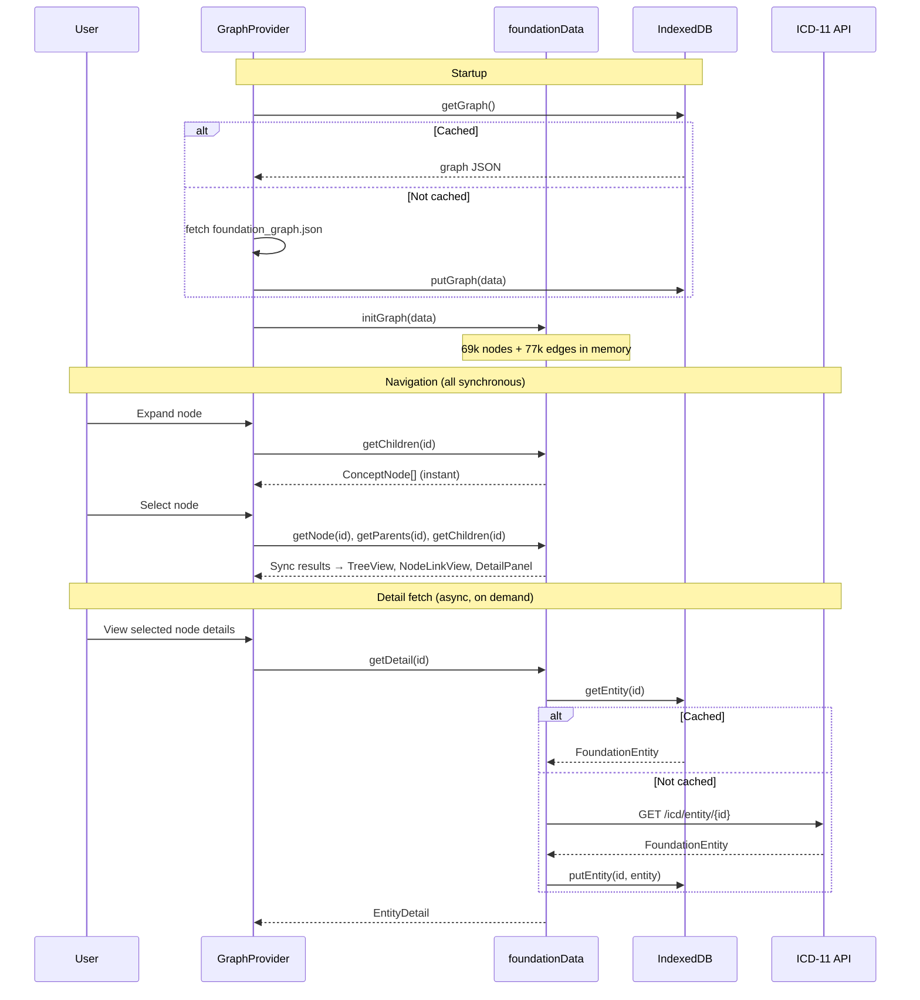

# ICD-11 Visual Maintenance Interface — Design Specification

## Overview

A visual interface to the ICD-11 maintenance platform that helps proposal authors and reviewers understand the neighborhood and potential impacts of proposed changes to the Foundation.

**Key goals:**
- Expose polyhierarchy structure (concepts with multiple parents)
- Facilitate understanding of change impacts
- Support proposal authoring workflow
- Provide hierarchical (not force-directed) visualizations

**Technology stack:** React, TypeScript, D3.js, graphology.js, elkjs, IndexedDB

**Deployment:** GitHub Pages (auto-deploy on push to main); later integration with .NET maintenance platform

---

## Implementation Status

Legend: :green_circle: Done | :red_circle: Bug | :yellow_circle: In progress / needs design | :white_circle: Not started | :black_circle: Future

| Area | Feature | Status |
|------|---------|--------|
| **Tree View** | Expand/collapse, parent/child badges | :green_circle: |
| | Multi-path highlighting | :green_circle: |
| | Descendant count + depth badges in tree | :yellow_circle: Data available, display TBD |
| | First-occurring path expansion via URL | :red_circle: Uses arbitrary parent |
| | Collapse heuristics for large trees | :white_circle: |
| **Node-Link View** | Hierarchical layout (elkjs), click to navigate | :green_circle: |
| | Ancestor chain to second level | :green_circle: |
| | Collapsible clusters (threshold: 2) | :green_circle: |
| | Resizable panels | :green_circle: |
| | Foundation ordering of siblings | :yellow_circle: Partially (model order hint) |
| | [Scalability features #3–10](#potential-solutions) | :white_circle: See design section |
| **Detail Panel** | Title, definition (async), browser link | :green_circle: |
| | Collapsible parents/children lists | :green_circle: |
| | Children missing badges | :red_circle: |
| | Paths to root | :yellow_circle: |
| **Data Layer** | Full graph preload + IndexedDB cache | :green_circle: |
| | On-demand entity detail fetch | :green_circle: |
| **Proposal Authoring** | All features | :black_circle: |

---

## Data Model

### ICD-11 Foundation Structure

The Foundation is a polyhierarchy: concepts can have multiple parents. ~69k entities, ~77k edges.

### Canonical vs Linked Parents

> **Investigation needed:** The maintenance platform distinguishes between regular and "linked" parent relationships. Some children appear grayed out in the maintenance platform, suggesting a different relationship type.
>
> **Hypothesis:** The canonical parent may be determined by where the concept appears in the MMS linearization.
>
> **Action:** Verify whether the public API exposes this distinction, or if it must be inferred by cross-referencing Foundation and MMS.

### Internal Representation

<details>
<summary>Types and data flow (click to expand)</summary>

The full Foundation graph is pre-crawled and loaded at startup. graphology.js stores the in-memory structure:

```typescript
// Structural data — available synchronously after init
interface ConceptNode {
  id: string;
  title: string;
  parentCount: number;
  childCount: number;
  childOrder: string[];      // children in Foundation order
  descendantCount: number;   // unique descendants (pre-computed)
  height: number;            // longest downward path to any leaf (leaf=0)
  depth: number;             // shortest path from root (root=0)
  maxDepth: number;          // longest path from root (root=0)
}

// Rich metadata — fetched on-demand from ICD-11 API, cached in IndexedDB
interface EntityDetail {
  definition?: string;
  longDefinition?: string;
  synonyms: string[];
  narrowerTerms: string[];
  inclusions: string[];
  exclusions: Array<{ label: string; foundationReference?: string }>;
  browserUrl?: string;
}
```

Edges are untyped directed edges (parent → child). See `foundationData.ts` for the unified data API.

#### Three-Layer Architecture

1. **`foundationStore.ts`** — IndexedDB cache. Stores/retrieves graph structure and entity details.
2. **`foundationData.ts`** — Unified data API. Owns the graphology instance. Sync reads for structure, async for entity details.
3. **`GraphProvider.tsx`** — React context. UI state (selection, expansion paths) and init. Exposes `foundationData` functions on context.

#### Data Flow



</details>

---

## Views

### 1. Indented Tabular View (Primary)

The main navigation interface. Renders the polyhierarchy as a tree where concepts with multiple parents appear multiple times. All instances reference the same underlying object — selection of one highlights all.

<details>
<summary>Current behavior and mockup (click to expand)</summary>

| Feature | Status |
|---------|--------|
| Same object, multiple appearances (selection syncs all) | :green_circle: |
| Parent count badge `[N↑]` (when > 1) | :green_circle: |
| Child count badge `[N↓]` | :green_circle: |
| Expand on demand (instant, in-memory) | :green_circle: |
| Multi-path highlighting | :green_circle: |

```
┌────────────────────────────────────────────────────┐
│ ▼ Diabetes mellitus                    [1↑] [8↓]   │
│   ▶ Type 1 diabetes mellitus           [1↑] [3↓]   │
│   ▶ Type 2 diabetes mellitus           [1↑] [5↓]   │
│   ▶ Malnutrition-related diabetes      [1↑] [0↓]   │
│   ▷ Diabetes mellitus in pregnancy     [2↑] [2↓]   │  ← muted style (linked?)
│   ▷ Neonatal diabetes mellitus         [2↑] [1↓]   │  ← muted style (linked?)
│   ▶ Acute complications of DM          [1↑] [4↓]   │
└────────────────────────────────────────────────────┘
```

</details>

#### Open design work

- **Descendant stats badges**: Data available on `ConceptNode` (descendantCount, height). Need to design badge placement in tree rows.
- **First-occurring path expansion** :red_circle:: URL navigation (`?node=ID`) uses `parent[0]` which may not be first in Foundation order.
- **Collapse heuristics**: Auto-collapse deep/large subtrees based on depth, subtree size, or user preference.
- **Show all paths to root**: Detail panel or tree-integrated breadcrumbs showing every distinct path from selected node to root.

### 2. Node-Link Diagram (Secondary)

D3-based DAG visualization of the local neighborhood around the selected node.

**Current state:** Hierarchical layout (elkjs), ancestor chain to second level, collapsible clusters for high-degree nodes (threshold: 2 visible children), click to navigate, resizable panels.

#### Scalability & Readability

The core design challenge. High-degree nodes (up to 331 children) make the view unreadable at any zoom level.

#### Potential Solutions

| # | Approach | Status | Notes |
|---|----------|--------|-------|
| 1 | **Ancestors beyond 1-hop** | :green_circle: | Chain to depth 2 (skip root + top-level) |
| 2 | **Collapsible clusters** | :green_circle: | First 2 children shown, rest grouped as "N more..." |
| 3 | **Hover shows hidden neighbors** | :white_circle: | Transiently show parents/children not in view |
| 4 | **Right-click/long-click toggle** | :white_circle: | Pin/unpin specific neighbors |
| 5 | **Close individual nodes** | :white_circle: | X button; closed nodes rejoin cluster count |
| 6 | **Area-proportional badges** | :white_circle: | Badge area ∝ count; median = default size; separate medians per type |
| 7 | **Staggered levels** | :white_circle: | Labella.js-style overlap avoidance |
| 8 | **Resizable panels** | :green_circle: | Drag dividers between three panels |
| 9 | **Pop-out window** | :white_circle: | Full-screen node-link in separate window |
| 10 | **Hybrid layout** | :white_circle: | Vertical ancestors, horizontal children |

#### Feature Compatibility


**Works well together:**
- **2+6** (Clusters + Badges): Collapsed clusters show aggregate badge values.
- **3+4** (Hover + Toggle): Hover previews → right-click pins. Natural progression.
- **4+5** (Toggle + Close): Unify as per-node visibility state via context menu + close button.
- **2+3** (Clusters + Hover): Hover over cluster to preview contents.
- **6** (Badges): Orthogonal to all others — renders independently within each node.

**Needs care:**
- **5+2** (Close + Clusters): Closed nodes rejoin cluster counter, e.g., "2 parents (1 hidden)."
- **3+5** (Hover + Close): Hover temporarily shows closed nodes → three-valued visibility state.
- **9** (Pop-out): Cross-window sync questions. Minimal viable approach: no sync with tree, just allow exploring and selecting a new focal node in the pop-out.
  - **[sg]** maybe just leave the middle panel alone and no communication between pop-out and tree/details, just allow the user to explore the node-link view separately in a wide screen. hmm... after exploring they might want to choose a new focal node, could allow just that
- **10+1** (Hybrid + Ancestors): Ancestors are linear → vertical. Children fan out → horizontal. elkjs supports per-compound-node `elk.direction` but doesn't cleanly isolate directions. Practical approaches: two-pass layout, manual post-processing, or igraph.

**Node visibility state model** (for #3, #4, #5):

| State | Meaning | How set |
|-------|---------|---------|
| **default** | Neighborhood algorithm decides | Initial state |
| **pinned** | Always shown | Right-click toggle on |
| **closed** | Hidden unless hovered | Close button or toggle off |

Hover temporarily overrides `closed` → visible. Changing focus resets all to `default`.

#### Design Notes

> **[sg]**
> - Collapsible clusters (#2): good idea. Will have to try some things and see how it works with other techniques
> - Fisheye: good technique for unreadable stuff; try if other approaches don't fully solve the problem. Radial layout: no.
> - Area-proportional badges (#6): don't size the rectangles — size individual badges. Badges on right side of concept name, area ∝ count, median count = default size, separate medians for parent/child/descendant badges
> - Hover (#3): could consider ideas from `../dynamic-model-var-docs/src/components/` (FloatingBoxManager, LayoutManager, TransitoryBox) — prior art for persistent/transitory info display in crowded spaces
> - If there are edge types or other ways of grouping neighboring nodes, show them as groups that can be explored or expanded
> - Staggered levels (#7): see https://twitter.github.io/labella.js/ — try both simple and overlap algorithms. Horizontal flow: see https://twitter.github.io/labella.js/with_text.html
> - Hybrid layout (#10): elkjs doesn't cleanly isolate directions. Practical approaches: (a) two-pass layout, (b) manual post-processing, (c) igraph.

#### Implementation Priority

**Phase 1 — High impact, low/medium effort:** :green_circle: Done
- #8 Resizable panels, #2 Collapsible clusters, #1 Ancestors beyond 1-hop

**Phase 2 — Medium impact, medium effort:**
- #6 Area-proportional badges — descendant data already on every node, orthogonal to layout
- #3 Hover preview — valuable for exploration, moderate complexity

**Phase 3 — Depends on Phase 2:**
- #4+5 Toggle/Close (unified as visibility state) — most useful once clusters and hover exist
- #7 Staggered levels — evaluate after clusters; may require replacing elkjs

**Defer:**
- Fisheye — only if the above doesn't suffice

### 3. Detail Panel

Shows concept metadata, parents list, children list. Title appears instantly from graph; definition loads asynchronously from API (cached in IndexedDB).

<details>
<summary>Current state and known issues (click to expand)</summary>

**Implemented:**
- Concept title, definition (async), long definition
- Link to Foundation browser
- Collapsible parents list with `[N↑]` badges (click to navigate)
- Collapsible children list (click to navigate)
- Descendant count in metadata

**Known issues:**
- :red_circle: Children list missing `[N↓]` badges (parents have them)
- Parents/children lists largely duplicate the tree. Should show information not visible in tree.

</details>

#### Open design work

- **Paths to root**: Show all distinct paths from selected node to root as clickable breadcrumb trails. Directly addresses the polyhierarchy navigation problem.
  ```
  Paths to Root:
    1. ... > Bacterial intestinal infections > Abdominal actinomycosis
    2. ... > Other bacterial diseases > Actinomycosis > Abdominal actinomycosis
  ```

---

## Proposal Authoring

> **Note:** Interface design TBD. Include this capability in the architecture.

<details>
<summary>Requirements and design questions (click to expand)</summary>

### Requirements

1. **View existing proposals** affecting a concept or its neighborhood
2. **Author new proposals** for adding, modifying, moving, or deprecating concepts (including multi-concept changes)
3. **Visualize proposal impact** — what would change if this proposal is implemented?

### Open Design Questions

| Question | Options |
|----------|---------|
| **Authoring location** | In-place editing on the tree? Separate form panel? Modal dialog? |
| **Diff visualization** | Side-by-side trees? Overlay with color-coded changes? Animated transition? |
| **Draft management** | Local storage? Backend persistence? Export as JSON? Will need to understand .NET Maintenance Platform before deciding. |

Color coding for diffs: green = added, red = removed, yellow = modified, gray = unchanged.

</details>

---

## Open Questions / Future Investigation

1. **Canonical/linked distinction**: Does the WHO API expose this or only iCAT?
2. **Integration path**: How will this embed into the .NET maintenance platform?
3. **Depth spread as maintenance signal**: Each node has `depth` (shortest path from root) and `maxDepth` (longest path from root). For polyhierarchy nodes these differ — 11,345 nodes (16%) have spread. Large spread may flag structural anomalies (e.g., a specific concept that's also directly under a high-level chapter). Consider surfacing depth range in the detail panel and/or using it as a filter/highlight for maintenance review. Cf. OHDSI/OMOP approach of storing both min and max path lengths.

---

## References

- ICD-11 Foundation Browser: https://icd.who.int/browse/2025-01/foundation/en
- ICD-11 Maintenance Platform: https://icd.who.int/dev11 (requires login)
- ICD-11 API Documentation: https://icd.who.int/icdapi
- graphology.js: https://graphology.github.io/
- igraph: https://igraph.org/
- elkjs: https://github.com/kieler/elkjs
- Labella.js: https://twitter.github.io/labella.js/

#### Wireframes & Screenshots

Working screenshots and wireframes live in `design-stuff/spec-assets/`.

Naming convention: `{component}-{description}-{date or version}.png`
