# ICD-11 Visual Maintenance Interface — Design Specification

## Overview

A visual interface to the ICD-11 maintenance platform that helps proposal authors and reviewers understand the neighborhood and potential impacts of proposed changes to the Foundation.

**Key goals:**
- Expose polyhierarchy structure (concepts with multiple parents)
- Facilitate understanding of change impacts
- Support proposal authoring workflow
- Provide hierarchical (not force-directed) visualizations

**Technology stack:** React, TypeScript, D3.js, graphology.js

**Deployment:** Standalone prototype initially; later integration with .NET maintenance platform

---

## Implementation Status

Legend: :green_circle: Implemented | :red_circle: Bug | :yellow_circle: Needs design | :white_circle: Not implemented | :black_circle: Not started

| Area | Feature | Status |
|------|---------|--------|
| [**Tree View**](#1-indented-tabular-view-primary) | [Expand/collapse, lazy loading, badges](#key-behaviors) | :green_circle: Implemented |
| | [Multi-path highlighting](#key-behaviors) (all occurrences of selected node) | :green_circle: Implemented |
| | [Descendant count + depth badges](#key-behaviors) | :yellow_circle: Needs design |
| | [First-occurring path expansion via URL](#key-behaviors) | :red_circle: Bug — uses arbitrary parent, not first in Foundation order |
| | [Collapse heuristics](#key-behaviors) for large trees | :white_circle: Not implemented |
| [**Node-Link View**](#2-node-link-diagram-secondary) | [Hierarchical layout with elkjs](#2-node-link-diagram-secondary) | :green_circle: Implemented |
| | [Foundation ordering of sibling nodes](#2-node-link-diagram-secondary) | :white_circle: Not implemented |
| | [Hover/click interaction design](#2-node-link-diagram-secondary) | :yellow_circle: Needs design |
| [**Detail Panel**](#3-context-menu--detail-panel) | [Title, definition, Foundation browser link](#3-context-menu--detail-panel) | :green_circle: Implemented |
| | [Collapsible parents/children lists](#3-context-menu--detail-panel) | :green_circle: Implemented |
| | [Badge inconsistency](#3-context-menu--detail-panel) (parents have badges, children don't) | :red_circle: Bug |
| | [Paths to root](#3-context-menu--detail-panel) (replace flat parent list) | :yellow_circle: Needs design |
| | [Proposals section](#proposal-authoring) | :black_circle: Not started |
| [**Data Layer**](#component-architecture) | [Memoized API, node creation, child loading](#data-flow) | :green_circle: Implemented |
| | [Eager parent path loading](#data-flow) for multi-parent nodes | :green_circle: Implemented |
| [**Proposal Authoring**](#proposal-authoring) | [All features](#requirements) | :black_circle: Not started |

---

## Data Model

### ICD-11 Foundation Structure

The Foundation is a polyhierarchy: concepts can have multiple parents. The public API provides the full graph structure.


In this example, "Diabetes mellitus in pregnancy" has two parents: "Diabetes mellitus" and (potentially) a pregnancy-related chapter.

### Canonical vs Linked Parents

> **Investigation needed:** The maintenance platform appears to distinguish between regular (calling them canonical for now) and "linked" parent relationships. In the maintenance platform view of "Diabetes mellitus," some children (e.g., "Diabetes mellitus in pregnancy," "Neonatal diabetes mellitus") appear grayed out, suggesting they are "linked" rather than direct children.
>
> **Hypothesis:** The canonical parent may be determined by where the concept appears in the MMS (Mortality and Morbidity Statistics linearization). The Foundation is the full polyhierarchy; MMS picks one path.
>
> **Reference links:**
> - Maintenance platform (requires login): https://icd.who.int/dev11/proposals/f/icd/en#/http%3a%2f%2fid.who.int%2ficd%2fentity%2f1217915084
> - Foundation browser: https://icd.who.int/browse/2025-01/foundation/en#119724091
>
> **Action:** Verify whether the public API exposes this canonical/linked distinction, or if it must be inferred by cross-referencing Foundation and MMS.

### Internal Representation

Use graphology.js for the graph data structure:

```typescript
import Graph from 'graphology';

interface ConceptNode {
  id: string;           // ICD entity URI
  title: string;        // Display name
  definition?: string;
  // ... other metadata
}

interface ParentEdge {
  type: 'is_a';         // or other relationship types if applicable
  isCanonical?: boolean; // if we can determine this
}

const graph = new Graph<ConceptNode, ParentEdge>();
```

---

## Views

### 1. Indented Tabular View (Primary)

The main navigation interface. Renders the polyhierarchy as a tree where concepts with multiple parents appear multiple times.

#### Conceptual Model: Same Object, Multiple Appearances

When a concept has multiple parents, it appears once under each parent in the tree. All instances reference the same underlying object.

```mermaid
graph TD
    subgraph "Conceptual Model — Not UI"
        R[Root]
        R --> A1[Concept A]
        R --> B1[Concept B]
        A1 --> C1["Concept C [2↑]"]
        B1 --> C2["Concept C [2↑]"]
    end
    
    style R fill:#d4e6f1,stroke:#333
    style A1 fill:#d5f5e3,stroke:#333
    style B1 fill:#fcf3cf,stroke:#333
    style C1 fill:#e7f,stroke:#333
    style C2 fill:#e7f,stroke:#333
```



C1 and C2 are the same object appearing in two places. Selection or modification of one instance affects all instances.

#### Key Behaviors

| Feature | Description | Status |
|---------|-------------|--------|
| **Same object, multiple appearances** | All instances of a concept reference the same object. Selection/modification in one location reflects everywhere. | :green_circle: |
| **Parent count badge** | Each node displays `[N↑]` indicating total parent count. Only shown when parentCount > 1. | :green_circle: |
| **Child count badge** | Display `[N↓]` for direct children count. | :green_circle: |
| **Descendant stats badge** | In addition to direct child count, show total descendant count and max depth. Requires crawling or caching subtree stats — nontrivial for large subtrees. | :yellow_circle: |
| **Collapse heuristics** | If tree gets too large, collapse nodes based on depth, subtree size, or user preference. | :white_circle: |
| **Expand on demand** | Lazy-load children; don't render entire Foundation at once. | :green_circle: |
| **Multi-path highlighting** | When a node with multiple parents is selected, all occurrences in the tree are highlighted. | :green_circle: |
| **First-occurring path expansion** | When navigating to a node via URL (`?node=ID`), the tree should expand the first-occurring path from root (per Foundation ordering), not an arbitrary parent. Currently uses `entity.parent[0]` which may not be first in Foundation order. | :red_circle: |
| **Show all paths to root** | When a node has multiple parents, the UI should make it easy to discover and navigate to all locations where it appears in the tree. See Detail Panel section. | :yellow_circle: |

#### UI Mockup

```
┌────────────────────────────────────────────────────┐
│ ▼ Diabetes mellitus                    [1↑] [8↓]   │
│   ▶ Type 1 diabetes mellitus           [1↑] [3↓]   │
│   ▶ Type 2 diabetes mellitus           [1↑] [5↓]   │
│   ▶ Malnutrition-related diabetes      [1↑] [0↓]   │
│   ▷ Diabetes mellitus in pregnancy     [2↑] [2↓]   │  ← muted style (linked?)
│   ▷ Neonatal diabetes mellitus         [2↑] [1↓]   │  ← muted style (linked?)
│   ▶ Acute complications of DM          [1↑] [4↓]   │
└────────────────────────────────────────────────────┘

Legend:
  ▼ = expanded
  ▶ = collapsed, has children  
  ▷ = collapsed, linked child (if canonical/linked distinction available)
  [N↑] = parent count
  [N↓] = child count
```

### 2. Node-Link Diagram (Secondary)

A more visual way to explore the local neighborhood structure.


**Key behaviors:**

| Feature              | Description | Status |
|----------------------|-------------|--------|
| **Hierarchical layout**  | Layered/hierarchical layout, not force-directed. Using elkjs. | :green_circle: |
| **Focus + context**      | Center on selected concept, show N hops of parents/children (currently 1-hop). | :green_circle: |
| **Click to navigate**    | Node clicks update selection (tree view and detail panel sync). | :green_circle: |
| **Parent/child badges**  | Same `[N↑]` `[N↓]` badges as tree view. | :green_circle: |
| **Foundation ordering**  | Nodes at the same layer should appear in Foundation order (matching the API's child ordering), not arbitrary. Currently arbitrary. | :white_circle: |
| **Hover/click behavior** | Currently hover does nothing and click only refocuses selection. What should hover show? Should click expand the neighborhood, navigate in the tree, or something else? | :yellow_circle: |

**Layout options to evaluate:**
- elkjs (Eclipse Layout Kernel, more sophisticated routing) I've never tried it, might be good.
- d3-dag (Sugiyama layout for DAGs)  Not good for forcing nodes to particular vertical layers.
- dagre (simpler, may suffice for local neighborhoods)  Have struggled with it in the past.
- **If I use a python backend, igraph allows for forced vertical layering.**

#### Scalability & Readability Problem

The current implementation becomes unreadable when node count exceeds ~10. The view auto-scales to fit all nodes in the container, which shrinks everything to illegibility.

<br/>
*Example: 19 nodes renders labels too small to read*

**Root causes:**
1. Auto-fit scaling with no minimum scale threshold
2. Showing full ancestor path to root (not just immediate parents)
3. No user control over zoom/pan
4. High-degree nodes (many children) create wide layouts

#### Potential Solutions

| Approach | Description | Pros | Cons |
|----------|-------------|------|------|
| **Pan + zoom** | Don't auto-fit; render at readable scale, let user navigate | Simple to implement; D3 has built-in support | User must manually navigate; may lose overview |
| **Limit neighborhood** | Show only immediate parents/children (true 1-hop) | Keeps node count manageable | Loses context of where concept sits in hierarchy |
| **Minimum scale** | Set floor (e.g., 0.5) on auto-scale | Preserves readability | Content may overflow; needs pan/zoom anyway |
| **Collapsible clusters** | Group excess children into "N more..." placeholder | Controls sprawl while showing counts | Adds interaction complexity |
| **Focus + context distortion** | Fisheye or semantic zoom - selected area large, periphery compressed | Shows everything at once | Can be disorienting; harder to implement |
| **Radial layout** | Fan out from focus node | Better for high-degree nodes | Loses hierarchical clarity |
| **Adaptive node sizing** | Shrink distant/less-important nodes | Maintains overview with readable focus | Visual hierarchy may confuse |

#### Design Discussion

> **[sg] Add your ideas and preferences here. What approaches seem most promising? What constraints should we consider?**

<!-- Discussion notes will go here -->

#### Wireframes & Screenshots

Store working screenshots and wireframes in `design-stuff/spec-assets/`. These are working documents, not polished assets.

Naming convention: `{component}-{description}-{date or version}.png`
- `node-link-unreadable-example.png`
- `node-link-zoom-wireframe-v1.png`
- `tree-view-badges-screenshot.png`

### 3. Context Menu / Detail Panel

Triggered by clicking on a node's badge or right-clicking the node.


**Content:**
- Concept title and metadata — :green_circle:
- Link to Foundation browser — :green_circle:
- Collapsible parents list (click name to navigate) — :green_circle:
- Collapsible children list (click name to navigate) — :green_circle:
- Link to create new child proposal — :black_circle:
- Existing proposals summary with link to maintenance platform — :black_circle: (placeholder shown)

**Known issues:**
- :red_circle: Parents list shows `[N↑]` badges on items but children list does not show `[N↓]` badges — inconsistent.
- Parents/children lists are largely redundant with what the tree already shows. To add value, the detail panel should show information not visible in the tree.

**:yellow_circle: Planned: Paths to Root**

Instead of (or in addition to) a flat parents list, show all distinct paths from the selected node to root. Each path is a breadcrumb trail with clickable nodes. This directly addresses the polyhierarchy navigation problem: when a node has multiple parents, the user can see exactly where it lives in the hierarchy and click to expand/scroll to that location in the tree.

```
Paths to Root:
  1. WHO Root > ICD Entity > ... > Bacterial intestinal infections > Abdominal actinomycosis
  2. WHO Root > ICD Entity > ... > Other bacterial diseases > Actinomycosis > Abdominal actinomycosis
```

---

## Proposal Authoring

> **Note:** Interface design TBD. Include this capability in the architecture.

### Requirements

1. **View existing proposals** affecting a concept or its neighborhood
2. **Author new proposals** for:
   - Adding a new concept (child of selected node)
   - Modifying a concept (title, definition, relationships)
   - Moving a concept (change parents)
   - Deprecating/removing a concept
   - **Modifications to multiple concepts at once**
3. **Visualize proposal impact** — what would change if this proposal is implemented?

### Open Design Questions

| Question | Options |
|----------|---------|
| **Authoring location** | In-place editing on the tree? Separate form panel? Modal dialog? |
| **Diff visualization** | Side-by-side trees? Overlay with color-coded changes? Animated transition? |
| **Draft management** | Local storage? Backend persistence? Export as JSON? Will need to understand .NET Maintenance Platform before deciding. |

### Diff Visualization Concept


Color coding:
- 🟢 Green: Added
- 🔴 Red: Removed
- 🟡 Yellow: Modified
- ⚪ Gray: Unchanged

---

## Component Architecture


### Key Components

| Component | Responsibility | Status |
|-----------|----------------|--------|
| `GraphProvider` | Loads and caches ICD-11 data in graphology instance. Memoized API calls, node creation, and child loading. Eagerly loads all paths to root for multi-parent children. | :green_circle: |
| `TreeView` | Renders indented tree with expand/collapse, badges, selection | :green_circle: |
| `TreeNode` | Individual node with badges, selection highlight | :green_circle: |
| `NodeLinkView` | D3-based DAG visualization of local neighborhood (elkjs layout) | :green_circle: Basic |
| `DetailPanel` | Shows concept metadata, parents, children, proposals | :green_circle: Partial |
| `ProposalEditor` | Authoring interface for new/modified proposals | :black_circle: |
| `DiffView` | Visualization of proposed changes vs current state | :black_circle: |

---

## Data Flow


---

## Open Questions / Future Investigation

1. **Canonical/linked distinction**: Does the WHO API expose this or only iCAT?
2. **Offline support**: Should the tool work with a local snapshot of the Foundation for faster iteration?
3. **Integration path**: How will this embed into the .NET maintenance platform?

---

## References

- ICD-11 Foundation Browser: https://icd.who.int/browse/2025-01/foundation/en
- ICD-11 Maintenance Platform: https://icd.who.int/dev11 (requires login)
- ICD-11 API Documentation: https://icd.who.int/icdapi
- graphology.js: https://graphology.github.io/
- igraph: https://igraph.org/
- elkjs: https://github.com/kieler/elkjs
- d3-dag: https://erikbrinkman.github.io/d3-dag/
