# ICD-11 Visual Maintenance Interface — Design Specification

## Overview

A visual interface to the ICD-11 maintenance platform that helps proposal authors and reviewers understand the neighborhood and potential impacts of proposed changes to the Foundation.

**Key goals:**
- Expose polyhierarchy structure (concepts with multiple parents)
- Facilitate understanding of change impacts
- Support proposal authoring workflow
- Provide hierarchical (not force-directed) visualizations

**Technology stack:** React, TypeScript, D3.js, graphology.js

**Deployment:** Standalone prototype initially; later integration with .NET maintenance platform

---

## Data Model

### ICD-11 Foundation Structure

The Foundation is a polyhierarchy: concepts can have multiple parents. The public API provides the full graph structure.


In this example, "Diabetes mellitus in pregnancy" has two parents: "Diabetes mellitus" and (potentially) a pregnancy-related chapter.

### Canonical vs Linked Parents

> **Investigation needed:** The maintenance platform appears to distinguish between regular (calling them canonical for now) and "linked" parent relationships. In the maintenance platform view of "Diabetes mellitus," some children (e.g., "Diabetes mellitus in pregnancy," "Neonatal diabetes mellitus") appear grayed out, suggesting they are "linked" rather than direct children.
>
> **Hypothesis:** The canonical parent may be determined by where the concept appears in the MMS (Mortality and Morbidity Statistics linearization). The Foundation is the full polyhierarchy; MMS picks one path.
>
> **Reference links:**
> - Maintenance platform (requires login): https://icd.who.int/dev11/proposals/f/icd/en#/http%3a%2f%2fid.who.int%2ficd%2fentity%2f1217915084
> - Foundation browser: https://icd.who.int/browse/2025-01/foundation/en#119724091
>
> **Action:** Verify whether the public API exposes this canonical/linked distinction, or if it must be inferred by cross-referencing Foundation and MMS.

### Internal Representation

Use graphology.js for the graph data structure:

```typescript
import Graph from 'graphology';

interface ConceptNode {
  id: string;           // ICD entity URI
  title: string;        // Display name
  definition?: string;
  // ... other metadata
}

interface ParentEdge {
  type: 'is_a';         // or other relationship types if applicable
  isCanonical?: boolean; // if we can determine this
}

const graph = new Graph<ConceptNode, ParentEdge>();
```

---

## Views

### 1. Indented Tabular View (Primary)

The main navigation interface. Renders the polyhierarchy as a tree where concepts with multiple parents appear multiple times.

#### Conceptual Model: Same Object, Multiple Appearances

When a concept has multiple parents, it appears once under each parent in the tree. All instances reference the same underlying object.

```mermaid
graph TD
    subgraph "Conceptual Model — Not UI"
        R[Root]
        R --> A1[Concept A]
        R --> B1[Concept B]
        A1 --> C1["Concept C [2↑]"]
        B1 --> C2["Concept C [2↑]"]
    end
    
    style R fill:#d4e6f1,stroke:#333
    style A1 fill:#d5f5e3,stroke:#333
    style B1 fill:#fcf3cf,stroke:#333
    style C1 fill:#e7f,stroke:#333
    style C2 fill:#e7f,stroke:#333
```



C1 and C2 are the same object appearing in two places. Selection or modification of one instance affects all instances.

#### Key Behaviors

| Feature | Description |
|---------|-------------|
| **Same object, multiple appearances** | All instances of a concept reference the same object. Selection/modification in one location reflects everywhere. |
| **Parent count badge** | Each node displays `[N↑]` indicating total parent count. Visible at every occurrence so user knows the concept exists elsewhere. |
| **Child count badge** | Display `[N↓]` for children. Click to expand or view in context menu. |
| **Collapse heuristics** | If tree gets too large, collapse nodes based on depth, subtree size, or user preference. |
| **Expand on demand** | Lazy-load children; don't render entire Foundation at once. |

#### UI Mockup

```
┌────────────────────────────────────────────────────┐
│ ▼ Diabetes mellitus                    [1↑] [8↓]   │
│   ▶ Type 1 diabetes mellitus           [1↑] [3↓]   │
│   ▶ Type 2 diabetes mellitus           [1↑] [5↓]   │
│   ▶ Malnutrition-related diabetes      [1↑] [0↓]   │
│   ▷ Diabetes mellitus in pregnancy     [2↑] [2↓]   │  ← muted style (linked?)
│   ▷ Neonatal diabetes mellitus         [2↑] [1↓]   │  ← muted style (linked?)
│   ▶ Acute complications of DM          [1↑] [4↓]   │
└────────────────────────────────────────────────────┘

Legend:
  ▼ = expanded
  ▶ = collapsed, has children  
  ▷ = collapsed, linked child (if canonical/linked distinction available)
  [N↑] = parent count
  [N↓] = child count
```

### 2. Node-Link Diagram (Secondary)

For exploring local neighborhood structure when the tree view doesn't convey relationships clearly.


**Key behaviors:**

| Feature              | Description |
|----------------------|-------------|
| **Hierarchical layout**  | Should be a layered/hierarchical layout, not force-directed.
| **Focus + context**      | Center on selected concept, show N hops of parents/children |
| **Click to navigate**    | Clicking a node in the diagram updates the tree view and diagram focus |
| **Parent/child badges**  | Same `[N↑]` `[N↓]` badges as tree view |

**Layout options to evaluate:**
- elkjs (Eclipse Layout Kernel, more sophisticated routing) I've never tried it, might be good.
- d3-dag (Sugiyama layout for DAGs)  Not good for forcing nodes to particular vertical layers.
- dagre (simpler, may suffice for local neighborhoods)  Have struggled with it in the past.
- **If I use a python backend, igraph allows for forced vertical layering.**

### 3. Context Menu / Detail Panel

Triggered by clicking on a node's badge or right-clicking the node.


**Content:**
- Concept title and metadata
- Link to Foundation browser
- Collapsible parents list (with checkboxes to show/hide in tree)
- Collapsible children list (with checkboxes, click name to navigate)
- Link to create new child proposal
- Existing proposals summary with link to maintenance platform

---

## Proposal Authoring

> **Note:** Interface design TBD. Include this capability in the architecture.

### Requirements

1. **View existing proposals** affecting a concept or its neighborhood
2. **Author new proposals** for:
   - Adding a new concept (child of selected node)
   - Modifying a concept (title, definition, relationships)
   - Moving a concept (change parents)
   - Deprecating/removing a concept
   - **Modifications to multiple concepts at once**
3. **Visualize proposal impact** — what would change if this proposal is implemented?

### Open Design Questions

| Question | Options |
|----------|---------|
| **Authoring location** | In-place editing on the tree? Separate form panel? Modal dialog? |
| **Diff visualization** | Side-by-side trees? Overlay with color-coded changes? Animated transition? |
| **Draft management** | Local storage? Backend persistence? Export as JSON? Will need to understand .NET Maintenance Platform before deciding. |

### Diff Visualization Concept


Color coding:
- 🟢 Green: Added
- 🔴 Red: Removed
- 🟡 Yellow: Modified
- ⚪ Gray: Unchanged

---

## Component Architecture


### Key Components

| Component | Responsibility |
|-----------|----------------|
| `GraphProvider` | Loads and caches ICD-11 data in graphology instance |
| `TreeView` | Renders indented tree with expand/collapse, badges, selection |
| `TreeNode` | Individual node with badges, context menu trigger |
| `NodeLinkView` | D3-based DAG visualization of local neighborhood |
| `DetailPanel` | Shows concept metadata, parents, children, proposals |
| `ProposalEditor` | TBD — authoring interface for new/modified proposals |
| `DiffView` | TBD — visualization of proposed changes vs current state |

---

## Data Flow


---

## Open Questions / Future Investigation

1. **Canonical/linked distinction**: Does the WHO API expose this or only iCAT?
2. **Offline support**: Should the tool work with a local snapshot of the Foundation for faster iteration?
3. **Integration path**: How will this embed into the .NET maintenance platform?

---

## References

- ICD-11 Foundation Browser: https://icd.who.int/browse/2025-01/foundation/en
- ICD-11 Maintenance Platform: https://icd.who.int/dev11 (requires login)
- ICD-11 API Documentation: https://icd.who.int/icdapi
- graphology.js: https://graphology.github.io/
- igraph: https://igraph.org/
- elkjs: https://github.com/kieler/elkjs
- d3-dag: https://erikbrinkman.github.io/d3-dag/
