# ICD-11 Visual Maintenance Interface — Design Specification

## Overview

A visual interface to the ICD-11 maintenance platform that helps proposal authors and reviewers understand the neighborhood and potential impacts of proposed changes to the Foundation.

**Key goals:**
- Expose polyhierarchy structure (concepts with multiple parents)
- Facilitate understanding of change impacts
- Support proposal authoring workflow
- Provide hierarchical (not force-directed) visualizations

**Technology stack:** React, TypeScript, D3.js, graphology.js, elkjs, IndexedDB

**Deployment:** GitHub Pages (auto-deploy on push to main); later integration with .NET maintenance platform

---

## Implementation Status

Legend: :green_circle: Implemented | :red_circle: Bug | :yellow_circle: Needs design | :white_circle: Not implemented | :black_circle: Not started

| Area | Feature | Status |
|------|---------|--------|
| [**Tree View**](#1-indented-tabular-view-primary) | [Expand/collapse, badges](#key-behaviors) | :green_circle: Implemented |
| | [Multi-path highlighting](#key-behaviors) (all occurrences of selected node) | :green_circle: Implemented |
| | [Descendant count + depth badges](#key-behaviors) | :yellow_circle: Data available, badge display needs design |
| | [First-occurring path expansion via URL](#key-behaviors) | :red_circle: Bug — uses arbitrary parent, not first in Foundation order |
| | [Collapse heuristics](#key-behaviors) for large trees | :white_circle: Not implemented |
| [**Node-Link View**](#2-node-link-diagram-secondary) | [Hierarchical layout with elkjs](#2-node-link-diagram-secondary) | :green_circle: Implemented |
| | [Scalability & readability](#scalability--readability-problem) | :yellow_circle: Biggest design challenge — see discussion |
| | [Foundation ordering of sibling nodes](#2-node-link-diagram-secondary) | :white_circle: Not implemented |
| | [Hover/click interaction design](#2-node-link-diagram-secondary) | :yellow_circle: Needs design |
| [**Detail Panel**](#3-context-menu--detail-panel) | [Title, definition, Foundation browser link](#3-context-menu--detail-panel) | :green_circle: Implemented (definition loads async) |
| | [Collapsible parents/children lists](#3-context-menu--detail-panel) | :green_circle: Implemented (all in memory) |
| | [Badge inconsistency](#3-context-menu--detail-panel) (parents have badges, children don't) | :red_circle: Bug |
| | [Paths to root](#3-context-menu--detail-panel) (replace flat parent list) | :yellow_circle: Needs design |
| | [Proposals section](#proposal-authoring) | :black_circle: Not started |
| [**Data Layer**](#component-architecture) | [Full graph preload + IndexedDB cache](#data-flow) | :green_circle: Implemented |
| | [On-demand entity detail fetch](#data-flow) | :green_circle: Implemented |
| [**Proposal Authoring**](#proposal-authoring) | [All features](#requirements) | :black_circle: Not started |

---

## Data Model

### ICD-11 Foundation Structure

The Foundation is a polyhierarchy: concepts can have multiple parents. The public API provides the full graph structure.


In this example, "Diabetes mellitus in pregnancy" has two parents: "Diabetes mellitus" and (potentially) a pregnancy-related chapter.

### Canonical vs Linked Parents

> **Investigation needed:** The maintenance platform appears to distinguish between regular (calling them canonical for now) and "linked" parent relationships. In the maintenance platform view of "Diabetes mellitus," some children (e.g., "Diabetes mellitus in pregnancy," "Neonatal diabetes mellitus") appear grayed out, suggesting they are "linked" rather than direct children.
>
> **Hypothesis:** The canonical parent may be determined by where the concept appears in the MMS (Mortality and Morbidity Statistics linearization). The Foundation is the full polyhierarchy; MMS picks one path.
>
> **Reference links:**
> - Maintenance platform (requires login): https://icd.who.int/dev11/proposals/f/icd/en#/http%3a%2f%2fid.who.int%2ficd%2fentity%2f1217915084
> - Foundation browser: https://icd.who.int/browse/2025-01/foundation/en#119724091
>
> **Action:** Verify whether the public API exposes this canonical/linked distinction, or if it must be inferred by cross-referencing Foundation and MMS.

### Internal Representation

The full Foundation graph is pre-crawled and loaded at startup. graphology.js stores the in-memory structure:

```typescript
// Structural data — available synchronously after init
interface ConceptNode {
  id: string;
  title: string;
  parentCount: number;
  childCount: number;
  childOrder: string[];      // children in Foundation order
  descendantCount: number;   // unique descendants (pre-computed)
  height: number;            // longest downward path to any leaf (leaf=0)
  depth: number;             // shortest path from root (root=0)
  maxDepth: number;          // longest path from root (root=0)
}

// Rich metadata — fetched on-demand from ICD-11 API, cached in IndexedDB
interface EntityDetail {
  definition?: string;
  longDefinition?: string;
  synonyms: string[];
  narrowerTerms: string[];
  inclusions: string[];
  exclusions: Array<{ label: string; foundationReference?: string }>;
  browserUrl?: string;
}
```

Edges are untyped directed edges (parent → child). See `foundationData.ts` for the unified data API.

---

## Views

### 1. Indented Tabular View (Primary)

The main navigation interface. Renders the polyhierarchy as a tree where concepts with multiple parents appear multiple times.

#### Conceptual Model: Same Object, Multiple Appearances

When a concept has multiple parents, it appears once under each parent in the tree. All instances reference the same underlying object.

```mermaid
graph TD
    subgraph "Conceptual Model — Not UI"
        R[Root]
        R --> A1[Concept A]
        R --> B1[Concept B]
        A1 --> C1["Concept C [2↑]"]
        B1 --> C2["Concept C [2↑]"]
    end
    
    style R fill:#d4e6f1,stroke:#333
    style A1 fill:#d5f5e3,stroke:#333
    style B1 fill:#fcf3cf,stroke:#333
    style C1 fill:#e7f,stroke:#333
    style C2 fill:#e7f,stroke:#333
```



C1 and C2 are the same object appearing in two places. Selection or modification of one instance affects all instances.

#### Key Behaviors

| Feature | Description | Status |
|---------|-------------|--------|
| **Same object, multiple appearances** | All instances of a concept reference the same object. Selection/modification in one location reflects everywhere. | :green_circle: |
| **Parent count badge** | Each node displays `[N↑]` indicating total parent count. Only shown when parentCount > 1. | :green_circle: |
| **Child count badge** | Display `[N↓]` for direct children count. | :green_circle: |
| **Descendant stats badge** | In addition to direct child count, show total descendant count and height. Data is pre-computed and available on `ConceptNode`; badge display needs design (shown in DetailPanel, not yet in tree). | :yellow_circle: |
| **Collapse heuristics** | If tree gets too large, collapse nodes based on depth, subtree size, or user preference. | :white_circle: |
| **Expand on demand** | Children expand instantly from in-memory graph. Full Foundation loaded at startup. | :green_circle: |
| **Multi-path highlighting** | When a node with multiple parents is selected, all occurrences in the tree are highlighted. | :green_circle: |
| **First-occurring path expansion** | When navigating to a node via URL (`?node=ID`), the tree should expand the first-occurring path from root (per Foundation ordering), not an arbitrary parent. Currently uses `entity.parent[0]` which may not be first in Foundation order. | :red_circle: |
| **Show all paths to root** | When a node has multiple parents, the UI should make it easy to discover and navigate to all locations where it appears in the tree. See Detail Panel section. | :yellow_circle: |

#### UI Mockup

```
┌────────────────────────────────────────────────────┐
│ ▼ Diabetes mellitus                    [1↑] [8↓]   │
│   ▶ Type 1 diabetes mellitus           [1↑] [3↓]   │
│   ▶ Type 2 diabetes mellitus           [1↑] [5↓]   │
│   ▶ Malnutrition-related diabetes      [1↑] [0↓]   │
│   ▷ Diabetes mellitus in pregnancy     [2↑] [2↓]   │  ← muted style (linked?)
│   ▷ Neonatal diabetes mellitus         [2↑] [1↓]   │  ← muted style (linked?)
│   ▶ Acute complications of DM          [1↑] [4↓]   │
└────────────────────────────────────────────────────┘

Legend:
  ▼ = expanded
  ▶ = collapsed, has children  
  ▷ = collapsed, linked child (if canonical/linked distinction available)
  [N↑] = parent count
  [N↓] = child count
```

### 2. Node-Link Diagram (Secondary)

A more visual way to explore the local neighborhood structure.


**Key behaviors:**

| Feature              | Description | Status |
|----------------------|-------------|--------|
| **Hierarchical layout**  | Layered/hierarchical layout, not force-directed. Using elkjs. | :green_circle: |
| **Focus + context**      | Center on selected concept, show N hops of parents/children (currently 1-hop). | :green_circle: |
| **Click to navigate**    | Node clicks update selection (tree view and detail panel sync). | :green_circle: |
| **Parent/child badges**  | Same `[N↑]` `[N↓]` badges as tree view. | :green_circle: |
| **Foundation ordering**  | Nodes at the same layer should appear in Foundation order (matching the API's child ordering), not arbitrary. Currently arbitrary. | :white_circle: |
| **Hover/click behavior** | Currently hover does nothing and click only refocuses selection. What should hover show? Should click expand the neighborhood, navigate in the tree, or something else? | :yellow_circle: |

**Layout options to evaluate:**
- elkjs (Eclipse Layout Kernel, more sophisticated routing) I've never tried it, might be good.
- d3-dag (Sugiyama layout for DAGs)  Not good for forcing nodes to particular vertical layers.
- dagre (simpler, may suffice for local neighborhoods)  Have struggled with it in the past.
- **If I use a python backend, igraph allows for forced vertical layering.**

#### Scalability & Readability Problem

The current implementation becomes unreadable when node count exceeds ~10. The view auto-scales to fit all nodes in the container, which shrinks everything to illegibility.

<br/>
*Example: 19 nodes renders labels too small to read*

**Root causes:**
1. ~~Auto-fit scaling with no minimum scale threshold~~ — Fixed: minimum scale of 0.4
2. ~~Showing full ancestor path to root (not just immediate parents)~~ — Fixed: now shows true 1-hop neighborhood
3. ~~No user control over zoom/pan~~ — Fixed: D3 zoom/pan with controls
4. High-degree nodes (many children) create wide layouts — **still a problem**

Even with the fixes above, nodes with many children (e.g., 331 children for some Foundation categories) make the view unreadable. This is the core remaining challenge.

#### Potential Solutions

| # | Approach | Description | Status | Pros | Cons |
|---|----------|-------------|--------|------|------|
| — | **Pan + zoom** | Render at readable scale, let user navigate | :green_circle: Done | Simple; D3 built-in | May lose overview |
| — | **Minimum scale** | Floor (0.4) on auto-scale | :green_circle: Done | Preserves readability | Content overflows; needs pan/zoom |
| 1 | **Ancestors beyond 1-hop** | Show ancestor chain to second level (skip root), not just immediate parents | :yellow_circle: In progress | Context of where concept sits in hierarchy | More nodes to fit |
| 2 | **Collapsible clusters** | Group excess children into "N more..." placeholder (threshold: 2 visible) | :yellow_circle: In progress | Controls sprawl while showing counts | Adds interaction complexity |
| 3 | **Hover shows hidden neighbors** | On hover, transiently show parents/children not in view | :white_circle: | Exploration without committing to layout change | Transient state; can be jarring |
| 4 | **Right-click/long-click toggle** | Context menu to pin/unpin specific neighbors | :white_circle: | Fine-grained control over what's visible | UI complexity |
| 5 | **Close individual nodes** | X button to hide specific non-focus nodes | :white_circle: | Declutter on demand | What happens when node would reappear? |
| 6 | **Area-proportional badges** | Badges for parents/children/descendants sized so area ∝ count, with median count = default size. Separate median baselines per badge type. Badges on right side of concept name. | :white_circle: | Three independent visual channels without affecting node rectangle | Need to compute medians; very small/large counts need clamping |
| — | **Fisheye distortion** | Magnify area near cursor, compress periphery | :white_circle: | Shows everything at once | Disorienting; try if others don't suffice |
| 7 | **Staggered levels** | Labella.js-style label placement to avoid overlap | :white_circle: | Better use of horizontal space | New dependency; may not integrate with elkjs |
| 8 | **Resizable panels** | Make the three main panels resizable | :green_circle: Done | Low-hanging fruit; more room for node-link | Minor implementation effort |
| 9 | **Pop-out window** | Open node-link view in a separate browser window for full-screen use | :white_circle: | Full screen width; dual-monitor friendly | Cross-window state sync; interaction model questions |
| 10 | **Hybrid layout** | Vertical flow for ancestors, horizontal flow for children/descendants | :white_circle: | Better use of space; ancestors are a linear chain, children fan out | May need custom elkjs config or forked layout code |

#### Feature Compatibility Analysis


**Works well together:**
- **2+6** (Clusters + Badges): Collapsed clusters can show aggregate badge values — e.g., total descendants across clustered children.
- **3+4** (Hover + Toggle): Natural progression — hover previews, right-click pins. "I'm curious about this" → "I want to keep seeing this."
- **4+5** (Toggle + Close): Really the same feature — unify as a per-node visibility state managed via context menu and close button.
- **2+3** (Clusters + Hover): Hover over a cluster to preview its contents without expanding.
- **6** (Badges): Orthogonal to all other features — badges render independently within each node regardless of layout, clustering, or visibility state.

**Needs care:**
- **5+2** (Close + Clusters): Closed nodes should rejoin a cluster counter, not vanish entirely. E.g., "2 parents (1 hidden)."
- **3+5** (Hover + Close): Hover should temporarily show closed nodes. This means the state model is three-valued per node (see below).
- **9** (Pop-out window): Cross-window state sync — selection changes in tree must propagate to pop-out and vice versa. `BroadcastChannel` or `window.opener` messaging. What happens to the inline panel when pop-out is open? Hide it? Show a "popped out" placeholder?
  - **[sg] maybe just leave the middle panel alone and no communication between pop-out and tree/details,
           just allow the user to explore the node-link view separately in a wide screen. hmm... after exploring
           they might want to choose a new focal node, could allow just that
- **10+1** (Hybrid layout + Ancestors): Ancestors are a linear chain → vertical makes sense. Children fan out → horizontal uses width better. elkjs supports `elk.direction` per node group but may need compound node grouping or a two-pass layout.

**Node visibility state model:**

Each non-focus node needs a visibility state:
| State | Meaning | How it gets there |
|-------|---------|-------------------|
| **default** | Shown/hidden by the neighborhood algorithm | Initial state |
| **pinned** | Always shown regardless of neighborhood | Right-click toggle on |
| **closed** | Hidden unless hovered over | Close button or right-click toggle off |

Hover temporarily overrides `closed` → visible (transient). Changing focus node resets all states to `default`.

#### Design Notes

> **[sg]**
> - Limit neighborhood (#1): maybe one-hop limit unnecessary for ancestors
> - Collapsible clusters (#2): good idea. Will have to try some things and see how it works with other techniques
> - Fisheye: good technique for unreadable stuff; try if other approaches don't fully solve the problem
> - Radial layout: no
> - Area-proportional badges (#6): don't size the rectangles — size individual badges. Badges on right side of concept name, area ∝ count, median count = default size, separate medians for parent/child/descendant badges
> - Hover (#3): could consider ideas from `../dynamic-model-var-docs/src/components/` (FloatingBoxManager, LayoutManager, TransitoryBox) — prior art for persistent/transitory info display in crowded spaces
> - If there are edge types or other ways of grouping neighboring nodes, show them as groups that can be explored or expanded
> - Staggered levels (#7): see https://twitter.github.io/labella.js/ — try both simple and overlap algorithms
> - Horizontal flow: see https://twitter.github.io/labella.js/with_text.html
> - Resizable panels (#8): no brainer
> - Pop-out (#9): allow node-link view in a separate window for full-screen use
> - Hybrid layout (#10): vertical for ancestors, horizontal for children — better space utilization. elkjs supports `elk.direction` per compound node, but doesn't cleanly isolate layout directions within a single graph. Practical approaches: (a) two-pass layout — lay out ancestors vertically, freeze coordinates, lay out children horizontally separately; (b) manual post-processing — rotate/translate child subgraph after layout; (c) switch to igraph which has explicit forced vertical layering.

#### Implementation Priority

**Phase 1 — High impact, low/medium effort:**
- **#8 Resizable panels** — trivial, immediately useful, gives node-link view more room
- **#2 Collapsible clusters** — the single biggest readability fix for high-degree nodes
- **#1 Ancestors beyond 1-hop** — easy with full graph in memory, gives critical hierarchy context

**Phase 2 — Medium impact, medium effort:**
- **#6 Area-proportional badges** — descendant data already on every node, orthogonal to layout
- **#3 Hover preview** — valuable for exploration, moderate complexity (overlay positioning outside ELK layout)

**Phase 3 — Depends on Phase 2:**
- **#4+5 Toggle/Close** (unified as visibility state) — most useful once clusters and hover exist
- **#7 Staggered levels** — evaluate after clusters; may require replacing elkjs

**Defer:**
- **Fisheye** — only if the above doesn't suffice

#### Wireframes & Screenshots

Store working screenshots and wireframes in `design-stuff/spec-assets/`. These are working documents, not polished assets.

Naming convention: `{component}-{description}-{date or version}.png`
- `node-link-unreadable-example.png`
- `node-link-zoom-wireframe-v1.png`
- `tree-view-badges-screenshot.png`

### 3. Context Menu / Detail Panel

Triggered by clicking on a node's badge or right-clicking the node.


**Content:**
- Concept title and metadata — :green_circle:
- Link to Foundation browser — :green_circle:
- Collapsible parents list (click name to navigate) — :green_circle:
- Collapsible children list (click name to navigate) — :green_circle:
- Link to create new child proposal — :black_circle:
- Existing proposals summary with link to maintenance platform — :black_circle: (placeholder shown)

**Known issues:**
- :red_circle: Parents list shows `[N↑]` badges on items but children list does not show `[N↓]` badges — inconsistent.
- Parents/children lists are largely redundant with what the tree already shows. To add value, the detail panel should show information not visible in the tree.

**:yellow_circle: Planned: Paths to Root**

Instead of (or in addition to) a flat parents list, show all distinct paths from the selected node to root. Each path is a breadcrumb trail with clickable nodes. This directly addresses the polyhierarchy navigation problem: when a node has multiple parents, the user can see exactly where it lives in the hierarchy and click to expand/scroll to that location in the tree.

```
Paths to Root:
  1. WHO Root > ICD Entity > ... > Bacterial intestinal infections > Abdominal actinomycosis
  2. WHO Root > ICD Entity > ... > Other bacterial diseases > Actinomycosis > Abdominal actinomycosis
```

---

## Proposal Authoring

> **Note:** Interface design TBD. Include this capability in the architecture.

### Requirements

1. **View existing proposals** affecting a concept or its neighborhood
2. **Author new proposals** for:
   - Adding a new concept (child of selected node)
   - Modifying a concept (title, definition, relationships)
   - Moving a concept (change parents)
   - Deprecating/removing a concept
   - **Modifications to multiple concepts at once**
3. **Visualize proposal impact** — what would change if this proposal is implemented?

### Open Design Questions

| Question | Options |
|----------|---------|
| **Authoring location** | In-place editing on the tree? Separate form panel? Modal dialog? |
| **Diff visualization** | Side-by-side trees? Overlay with color-coded changes? Animated transition? |
| **Draft management** | Local storage? Backend persistence? Export as JSON? Will need to understand .NET Maintenance Platform before deciding. |

### Diff Visualization Concept


Color coding:
- 🟢 Green: Added
- 🔴 Red: Removed
- 🟡 Yellow: Modified
- ⚪ Gray: Unchanged

---

## Component Architecture


### Three-Layer Architecture

1. **`foundationStore.ts`** — IndexedDB cache. Stores/retrieves graph structure and entity details. No logic.
2. **`foundationData.ts`** — Unified data API. Owns the graphology instance. Sync reads for structure, async for entity details.
3. **`GraphProvider.tsx`** — React context. UI state (selection, expansion paths) and init. Exposes `foundationData` functions on context.

### Key Components

| Component | Responsibility | Status |
|-----------|----------------|--------|
| `foundationData` | Owns graphology instance. Sync structure reads, async detail fetch with IndexedDB caching. | :green_circle: |
| `foundationStore` | IndexedDB wrapper for graph and entity cache. | :green_circle: |
| `GraphProvider` | React context: init, selection, expansion paths. Exposes `foundationData` on context. | :green_circle: |
| `TreeView` | Renders indented tree with expand/collapse, badges, selection | :green_circle: |
| `TreeNode` | Individual node with badges, selection highlight | :green_circle: |
| `NodeLinkView` | D3-based DAG visualization of local neighborhood (elkjs layout) | :green_circle: Basic |
| `DetailPanel` | Shows concept metadata (async), parents, children, proposals | :green_circle: Partial |
| `ProposalEditor` | Authoring interface for new/modified proposals | :black_circle: |
| `DiffView` | Visualization of proposed changes vs current state | :black_circle: |

---

## Data Flow


---

## Open Questions / Future Investigation

1. **Canonical/linked distinction**: Does the WHO API expose this or only iCAT?
2. **Integration path**: How will this embed into the .NET maintenance platform?
3. **Depth spread as maintenance signal**: Each node has `depth` (shortest path from root) and `maxDepth` (longest path from root). For polyhierarchy nodes these differ — 11,345 nodes (16%) have spread. Large spread may flag structural anomalies (e.g., a specific concept that's also directly under a high-level chapter). Consider surfacing depth range in the detail panel and/or using it as a filter/highlight for maintenance review. Cf. OHDSI/OMOP approach of storing both min and max path lengths.

---

## References

- ICD-11 Foundation Browser: https://icd.who.int/browse/2025-01/foundation/en
- ICD-11 Maintenance Platform: https://icd.who.int/dev11 (requires login)
- ICD-11 API Documentation: https://icd.who.int/icdapi
- graphology.js: https://graphology.github.io/
- igraph: https://igraph.org/
- elkjs: https://github.com/kieler/elkjs
- d3-dag: https://erikbrinkman.github.io/d3-dag/
